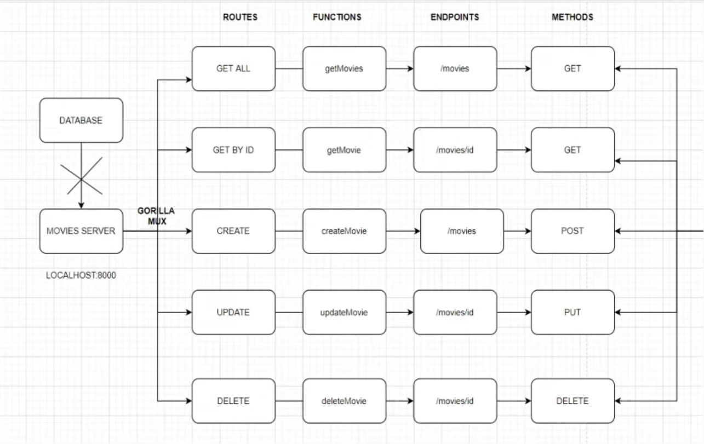

# 🎬 Go Movies CRUD API (No Database)

This project is a simple REST API built with **Go** and **Gorilla Mux** that allows you to perform full CRUD (Create, Read, Update, Delete) operations on movies — all stored in memory using Go **structs** and **slices**, without any database.

---

## 🧠 Architecture Overview



---

## 🛠️ Technologies Used

- Go (Golang)
- Gorilla Mux (HTTP Router)
- Encoding/JSON
- net/http

---

## 📦 Features

- Get all movies
- Get movie by ID
- Add a new movie
- Update a movie
- Delete a movie

---

## 🚀 Getting Started

### 1. Clone this repo

```bash
git clone https://github.com/your-username/go-movies-crud.git
cd go-movies-crud
````

### 2. Initialize Go Module

```bash
go mod init go-movies-crud
go get github.com/gorilla/mux
```

### 3. Run the Project

```bash
go run main.go
```

API will start at:

```
http://localhost:8000
```

---

## 📡 API Endpoints

| Method | Endpoint       | Description        |
| ------ | -------------- | ------------------ |
| GET    | `/movies`      | Get all movies     |
| GET    | `/movies/{id}` | Get movie by ID    |
| POST   | `/movies`      | Create a new movie |
| PUT    | `/movies/{id}` | Update a movie     |
| DELETE | `/movies/{id}` | Delete a movie     |

---

## 📥 Sample POST JSON Body

```json
{
    "isbn": "123456",
    "title": "Inception",
    "director": {
        "firstname": "Christopher",
        "lastname": "Nolan"
    }
}
```

---

## ⚠️ Notes

* Data is stored only in memory (slice), so it will reset every time the server restarts.
* IDs are auto-generated on creation using `rand.Intn()`.
* No database used. Perfect for beginners to learn CRUD and routing.

---

## 📄 License

This project is open source and free to use under the MIT License.

---

Let me know if you want a GitHub-style badge, `.env` example, or Docker support added too.
